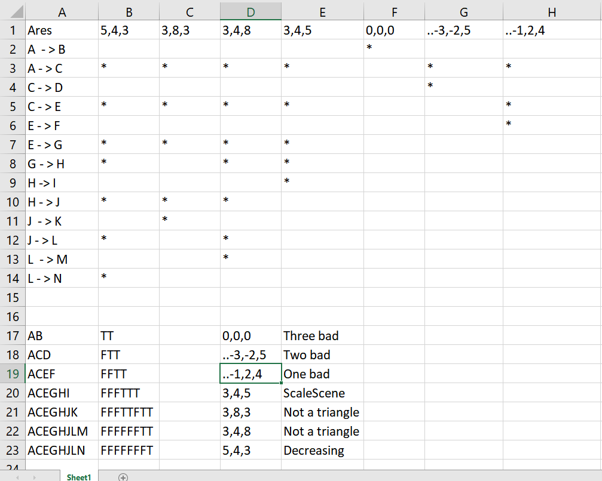

# Втора лабораториска вежба по Софтверско инженерство

## Трајче Клинчаров, бр. на индекс 163212

### Група на код:

Ја добив групата на код 2

###  Control Flow Graph

Фотографија од control flow graph-ot 

### Цикломатска комплексност

Цикломатската комплексност на овој код е 2, истата ја добив преку формулата P+1, каде што P е бројот на предикатни јазли.
Во случајoв P=1, па цикломатската комплексност изнесува 2.
 
 
- E = 15
- N = 13
- P = 4

15-13+2*4=10

### Тест случаи според критериумот  Every Branch 

Со наредната слика се исполнети сите можни тест случаеви односно патишта низ програмата.
Како што можеме да видеме Од А до N ни се појавуваат сите патишта.
Најмалиот пат каде што сите внесени аргументи ни се празни односно немаме усер.
Вториот пат каде  што кај нашиот корисник тој има аргумент кој му се погрешен како неговото име можно е да е нул или да постои.
Третиот пат кога ги поминал првите 2 случаеви без грешка но заборавил емаил.
Четвротиот кога емаилот има грешка односно е грешка напишан нема мајмунче.
Петиот кога згрешил односно заборавил точка
Шестиот е проверка за предходните два и доколку еден од нив го задоволува автоматски му е грешен емаилот.
Седмиот случај е кога нема грешка односно податоците се целосни.

### Тест случаи според критериумот Multiple Coverage

Како што можеме да видиме од if-statements-от имаме 6 можни гранки каде што можеме да добиеме различен резултат.
Првата гранка се состои од целиот објект ако е нул на следниот бренч завршуваме ако не продолжуваме. 
Вториот доколку имаме грешно име можеме да добиеме 3 случаеви каде што тука ни завршува програмата и 1 каде што продолжуваме. 
Наредниот се базира на емаилот имаме 2 случаеви доколку е нул прекинуваме доколку не продолжуваме. 
Четвртиот и Петиот исто така се за емаилот каде што четвртиот проверува дали има одреден карактер 
и влијае на наредниот односно петиот ако се исполни четвртиот автоматски се исполнува петиот. 
Шестиот е доколку било кој дали четвртиот или шестиот се  точни завршуваме со програмата 4 можни комбинации.
И на крај доколку ништо од ова не се исполни излегуваме успешно од програмата без никаков проблем.

### Објаснување на напишаните unit tests

...
Во напишаните unit test јас ги испитувам двата критериуми, почнувајчи од every branch потоа multiple coverage.
Тестовите се напишани така што тие ги поседуваат сите случаеви на предходните 2 критериуми.
...
